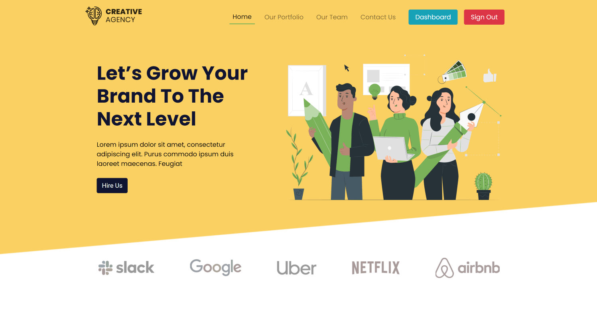

# Volunteer Network

A responsive IT Service Seller web application.

[Live Website](https://creative-agency-ea3df.firebaseapp.com/) | [Live API Server](https://creative-agency-react.herokuapp.com)

## Feature

- Responsive MERN Stack project with firebase authentication, admin authentication, persistent login and dashboard functionality for customer and admin
- Customer have ability to register in available services, check status of service(s) registered, and provide feedback
- Only admin can update the customer service status from pending to on going to done as well add new service with image.
- Customer need to click on service image card to register in specific service.
- Sign in is required to register in any service or to view Customer dashboard with services status.
- Logged in user will see a button named "Dashboard", where they can view the services they registered.
- If Admin is logged in, admin will see a button named "Admin".

Note: Only admin user have ability to view admin dashboard.

## Front-end Technology

- React JS
- Firebase Authentication (Google)
- React Router, Private Router
- React Hook Form
- React Context API
- React Hook
- Firebase Hosting
- Session Storage
- React Spinners
- React Spring
- React Slick
- Bootstrap
- CSS3
- FontAwesome
- Faker Api

## Back-end Technology

- Node JS
- Express JS
- Express file upload
- Mongodb
- Heroku
- Cors
- Body parser
- Dotenv
- nodemon

[Front-end Repository](https://github.com/faisalcep/creative-agency-client)

---

## Key Feature Screenshots

> Logged In User Landing Page

> Logged In User Dashboard

> Admin Dashboard- Volunteer List

> Admin Dashboard- Add Event

